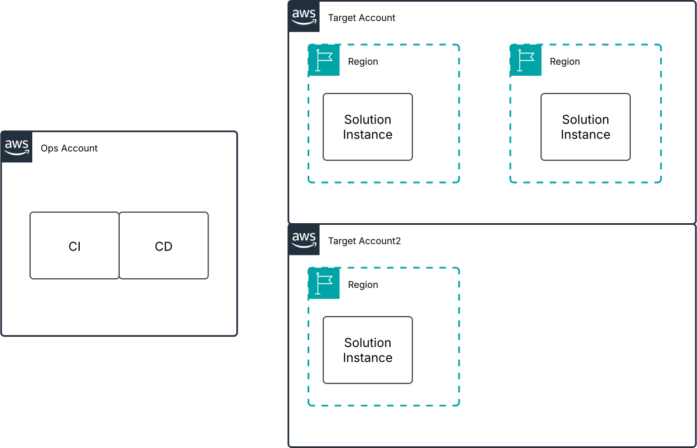

# Crawler Solution

## Overview

This design is intendent to describe the infrastructure needed to host the crawler solution and also the development and deployment related infrastructure and processes.

## Solution design
* [Solution High Level Design](documentation/solutionHLD.md)
* [Solution Low Level Design](documentation/solutionLLD.md)

## Development design
* [CI High Level Design](documentation/developmentHLD.md)
* [CI Low Level Design](documentation/developmentLLD.md)

## Deployment design
* [CD High Level Design](documentation/deploymentHLD.md)
* [CD Low Level Design](documentation/deploymentLLD.md)

## Robots
[solution](robots)