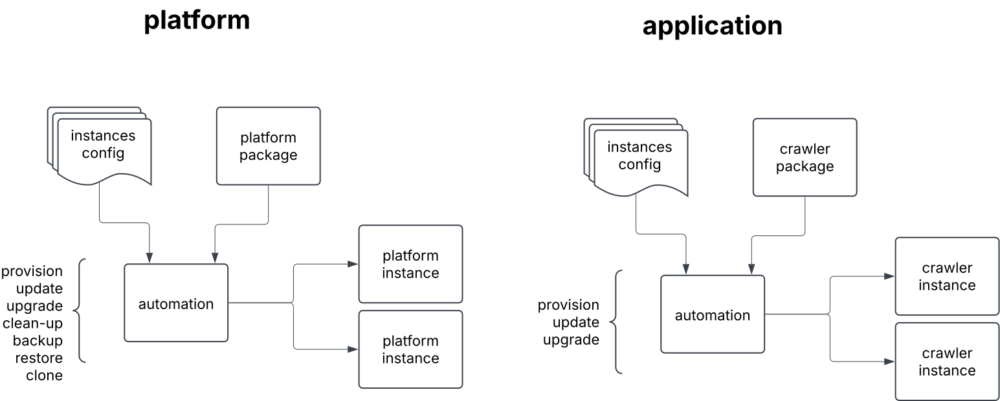

## Deployment High Level Design

### Objectives

- Define a **scalable, secure, and automated** deployment strategy for the platform.
- Ensure **reliable, repeatable, and consistent** deployments across all environments.
- Minimize downtime and risks associated with new releases through **progressive rollout strategies**.
- Leverage **AWS-native services** to enhance availability, fault tolerance, and cost efficiency.
- Enable **observability and traceability** of deployments for auditing and debugging.

### Features

- **Automated deployment pipelines** with which accepts deployment configuration, thus allowing instances variability between environments.
- **Immutable infrastructure** ensuring consistency between testing, staging, and production.
- **Blue/Green & Canary deployments** to mitigate release risks and allow incremental rollouts.
- **AWS cloud-native services** leveraged for deployment, scaling, and security.
- **Configuration as Code (CaC) and Infrastructure as Code (IaC)** for versioned and repeatable deployments.
- **Decoupled service deployments** allowing independent updates without affecting the entire system.

### Design Principles

- **Minimize manual intervention** by automating deployment, scaling, and rollback processes.
- **Ensure high availability** using AWS Auto Scaling, multi-region deployments, and redundancy.
- **Use Infrastructure as Code (IaC)** to maintain consistency, repeatability, and auditability.
- **Enable monitoring and alerting** for deployment failures.
- **Support multi-environment deployments** (e.g., INT, UAT, PROD) with isolated configurations.

### Use Cases

1. **Zero-downtime deployment**: A new version of the crawler is deployed using a **blue-green deployment**.
3. **Multi-environment deployment**: A developer promotes a tested feature from **INT → UAT → PROD** through an approval-based pipeline.
4. **Hotfix deployment**: A critical security patch is deployed directly to **production**.
5. **Infrastructure update**: A new AWS region is added for **geolocation optimization**, seamlessly replicating IaC configurations.

[[home]](../README.md)
[[back]](developmentLLD.md)
[[next]](deploymentLLD.md)