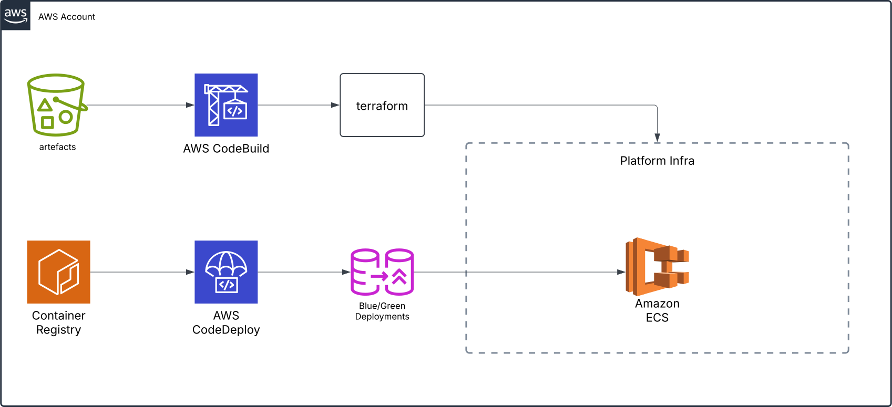

## Deployment Low Level Design

### Objectives

- Ensure **automated, reliable, and secure** deployments with minimal downtime.
- Provide **scalability** to handle different workloads and traffic fluctuations.
- Establish **observability and traceability** for all deployment activities.
- Maintain **consistency across environments** using Infrastructure as Code (IaC).
- Support **rapid rollback and recovery** in case of failures.

### Features

- **Immutable infrastructure** ensuring consistent deployments across environments.
- **Progressive deployment strategies** (e.g., Canary, Blue/Green, Rolling).
- **Automated rollback** in case of deployment failures.
- **AWS-native deployment services** (e.g., CodePipeline, ECS, Lambda).
- **Environment isolation** for development, staging, and production.
- **Centralized logging and monitoring** for deployments.
- **Secret management** for securing deployment credentials.

### Design Principles

- **Automate everything**: Minimize manual interventions in the deployment process.
- **Use AWS-native services**: Reduce operational overhead and enhance security.
- **Follow Infrastructure as Code (IaC)**: Maintain versioned, repeatable deployments.
- **Ensure security and compliance**: Enforce least privilege access and secrets management.
- **Optimize for cost efficiency**: Scale dynamically based on demand.
- **Enable real-time observability**: Use CloudWatch, X-Ray, and AWS Config for monitoring.
- **Fail fast and recover quickly**: Detect issues early and enable rapid rollback.

[[home]](../README.md)
[[back]](deploymentHLD.md)
[[next]](../README.md)
