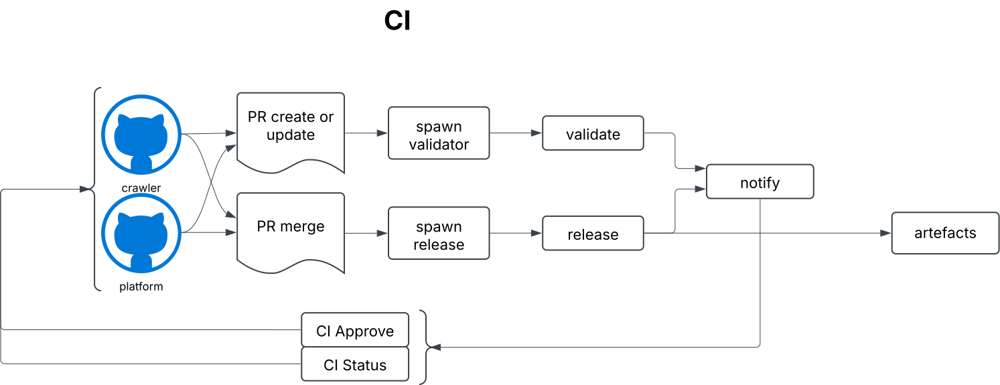

## Development High-Level Design  

  

### Objectives  

- Enable **efficient development, testing, and releasing** of the crawler  and the platform.  
- Ensure the system is **modular**, allowing independent component updates.  
- Support **continuous integration and deployment (CI/CD)** for rapid iterations.  
- Maintain **security and compliance** throughout the development lifecycle.  
- Provide **observability** for debugging, testing, and performance tuning.  

### Features 

- **Containerized development** using Docker for consistency across environments.  
- **Automated CI pipelines** for code deployment and infrastructure changes.  
- **IaC (Infrastructure as Code)** approach to ensure reproducibility and version control.  
- **GitOps model** for seamless integration with git services.  
- **Logging and monitoring** to track system performance and detect failures early.  

### Design Principles  

- Implement a **modular architecture** that enables innovation and allows branching logic when needed.  
- Maintain **immutability** for artifacts to minimize drift and ensure consistency in the validation process — what is tested is exactly what gets deployed.  
- Ensure **comprehensive observability** across all stages, covering cost analysis, performance monitoring, and debugging.  

### Use Cases  

1. A developer pushes a new feature to the repository, triggering an **automated CI pipeline** upon creating a pull request (PR). The pipeline runs **static code analysis, security checks, functional and end-to-end tests** in a sandbox environment. The developer receives real-time feedback, including the **status, test results, and log links**, as PR comments.  

2. A feature is ready for release but requires approval from multiple departments. The PR includes an **exhaustive list of validation logs** generated during the CI process, allowing stakeholders to make **data-driven approval decisions** based on objective test results.  

3. A feature is set for release, but a newly enforced **coding policy** causes a validation check to fail. Since the CI pipeline enforces **mandatory approval criteria**, the PR cannot be merged until the issue is resolved, ensuring compliance before deployment.  

[[home]](../README.md)
[[back]](solutionLLD.md) 
[[next]](developmentLLD.md)  