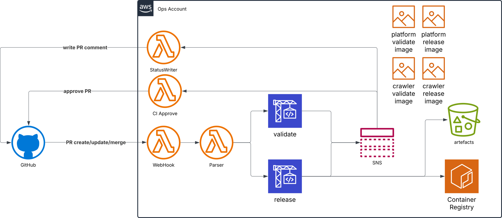

## Development Low-Level Design  

  

### Objectives  

- Define the **technical implementation details** for development workflows, validation and release processes
- Optimize **performance, security, and scalability** while maintaining cost efficiency.  
- Ensure **traceability** from code changes to deployments for auditability and debugging.  
- Provide a **developer-friendly environment** with fast feedback loops.  
- Minimize manual intervention through **automation and Infrastructure as Code (IaC)**.  

### Features  

- **Automated CI pipelines** enforce validation, security, and compliance checks at every stage.  
- **Immutable artifacts** (Docker images, IaC packages, etc.) guarantee consistency between testing and production environments.  
- **Embedded observability and logging** enable efficient monitoring, debugging, and troubleshooting.  
- **AWS cloud-native services** enhance **security, scalability, availability, and automation**.  
- Supports **reusable or customizable validation and release pipelines** per repository.  
- Allows **flexible validation policies**, distinguishing between **required** and **optional** checks.  
- Enables **delegation of validation and release tasks** to developers while enforcing critical checks at the system level.  

### Design Principles  

- **Infrastructure as Code (IaC)** ensures repeatable and auditable deployments.  
- **Minimize complexity** by leveraging AWS-native services and managed solutions.  
- **Fail-fast mechanisms** detect and block misconfigurations early in the pipeline.  
- **Security-first approach** enforces encryption, secret management, and compliance at every stage.  
- **Decoupled architecture** allows independent iteration on different system components.  

[[home]](../README.md)
[[back]](developmentHLD.md)
[[next]](deploymentHLD.md)  