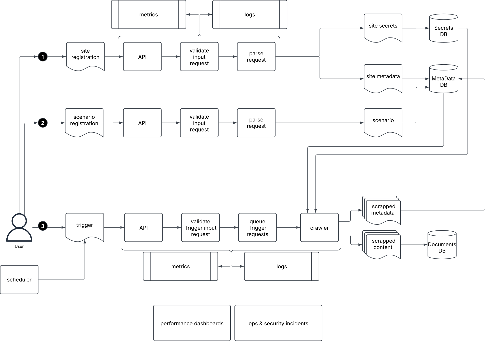

## Solution High-Level Design  
  

### Objectives  

- **User Access**: Users should be able to trigger crawler batches with predefined entry points and optional authentication.  
- **Admin Control**: Administrators should be able to quickly create multiple instances while ensuring system consistency and preventing configuration drift.  

### Features  

- The system maintains a **registry** of all site entry points, with full **CRUD operations** accessible via API.  
- During site entry registration, secrets are extracted and securely stored in an **encrypted vault**.  
- **Batch management** groups multiple sites into a single execution session.  
- Users can trigger the crawler via **API call** or a **scheduled job**.  
- A **scheduler** can automate execution at predefined intervals.  

### Design Principles  

- All **requests** are validated before processing or persistence.  
- **Data in transit** is encrypted for security.  
- **Only sensitive data** is encrypted at rest to optimize costs.  
- All processes publish **metrics and logs** for monitoring and debugging.  
- The system supports **multiple parallel crawler sessions**.  
- **Database retention policies** ensure storage efficiency and automatic cleanup of old or unused data.  
- Asynchronous batch processes return a **synchronous response** after validation, providing a session ID for later status tracking.  
- Each batch follows a structured lifecycle with four states:  
  - **NOT STARTED** – Accepted but pending execution (queued).  
  - **IN PROGRESS** – Currently running.  
  - **SUCCEEDED** – Completed successfully without fatal errors.  
  - **FAILED** – Completed with at least one fatal error.  
- The platform is fully described using **Infrastructure as Code (IaC)**.  
- Instance creation, deployment configuration updates, upgrades, and decommissioning are fully **automated**.  

### Use Cases  

1. A predefined batch runs weekly. If the batch **fails**, an **incident is created** and support is notified.  
2. A user registers **two site entry points** and creates a new batch including both sites. One site requires authentication, so credentials are provided during registration. The user triggers the batch and receives a **Slack notification** with the batch status and process metrics upon completion.  
3. A user manually **re-runs** a scheduled batch after resolving an issue.  
4. A DevOps engineer provisions **INT, UAT, and multiple PROD instances** of the system.  
5. A platform developer experiments with **substituting system components** and compares cost and operational complexity in an isolated environment.  

[[home]](../README.md)
[[back]](../README.md)
[[next]](solutionLLD.md)