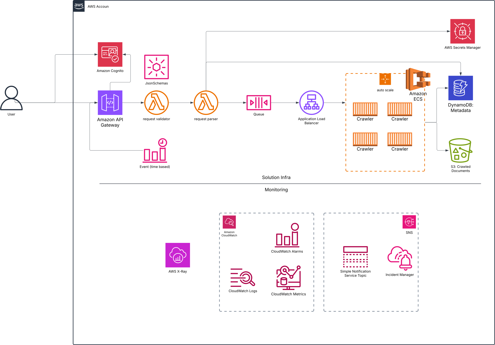

## Solution Low-Level Design  

  

### Objectives  

- The solution should be **cost-effective** in both idle and running states.  
- The implementation must be **scalable** and **secure**.  
- The solution should support **multi-region deployments** to bypass geofencing restrictions and reduce latency for certain sites.  
- The solution should enable **rapid deployment and innovation**.  
- It should be **easy to operate**.  
- The system should be **observable** for monitoring and debugging.  
- The system should implement **fail-fast mechanisms** to detect problems early in the chain.  

### Features  

- **Simplified operations** – No OS and Network maintenance required.  
- **AWS cloud-native services** are leveraged to enhance **security, scalability, availability**, and **automation**.  
- **ECS Fargate** is utilized, eliminating the need for VPCs.  

### Design Principles  

- Use **AWS-native** services (serverless-first approach).  
- Prioritize **ready-to-use components** to minimize custom development.  
- Avoid **VPCs**, favoring a simplified architecture.  
- System interaction is **API-driven** only.  
- Secure access and **internal communication** within the system.  
- Implement **observability** for **cost tracking, performance monitoring, and incident detection**.  

[[home]](../README.md)
[[back]](solutionHLD.md)
[[next]](developmentHLD.md)  