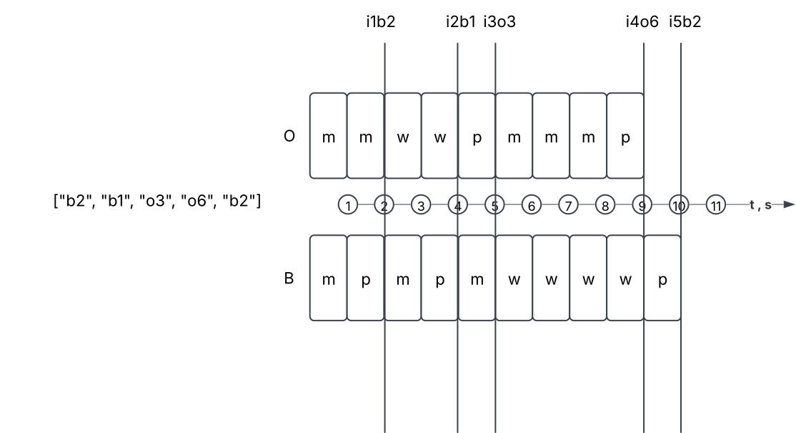

# Robot task

## Diagram for case 4



```text
Case 4
Input: ['b2', 'b1', 'o3', 'o6', 'b2']
Minimum time required: 10 seconds
```

| time | Orange           | Blue             |
|------|------------------|------------------|
| 1    | Move to button 2 | Move to button 2 |
| 2    | Move to button 3 | Push button 2    |
| 3    | Wait             | Move to button 1 |
| 4    | Wait             | Push button 1    |
| 5    | Push button 3    | Move to button 2 |
| 6    | Move to button 4 | Wait             |
| 7    | Move to button 5 | Wait             |
| 8    | Move to button 6 | Wait             |
| 9    | Push button 6    | Wait             |
| 10   | Wait             | Push button 2    |
